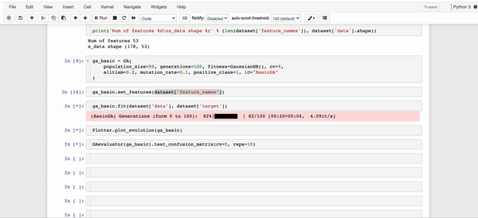

# PyWinEA

[![Contributors][contributors-shield]][contributors-url]
[![Forks][forks-shield]][forks-url]
[![Stargazers][stars-shield]][stars-url]
[![Issues][issues-shield]][issues-url]
[![MIT License][license-shield]][license-url]
[![LinkedIn][linkedin-shield]][linkedin-url]
<br />
<p align="center">
	
</p>

> Python package with lightweight implementations of genetic algorithms for classification/regression tasks.

## Description

The pywinEA module is a native python implementation of some of the most widely used genetic algorithms. 
This package has been developed on the top of scikit-learn which allows to use any model already implemented. This module aims to provide a good alternative to other feature selection techniques with full scikit-learn compatibility.

**Why evolutionary algorithms?**

One of the first stages in the development of any machine learning model is to filter out redundant and/or irrelevant attributes. However, the complexity of finding the best combination of attributes is most often an NP problem.

Among the most frequent feature selection strategies are embedded methods. These methods combine a heuristic search strategy with a classification/regression model. This is where genetic algorithms come into play. This type of strategy represents one of the best alternatives to address the immense space of search generally reaching good solutions.

## Install

### Dependencies

PyWinEA requires:
- Python (>= 3.6)
- NumPy (>= 1.13.3)
- SciPy (>= 0.19.1)
- Scikit-learn (>= 0.20.0)
- tqdm (>= 4.42.1)
- matplotlib (>= 3.1.3)
- pandas (>= 1.0.1)

```sh
pip install pywinEA
```
It is possible that older versions of the packages listed above may work. However, full compatibility is not guaranteed.

## Usage

Examples of the basic use of the package can be found in the notebooks directory. A diagram of the module structure is also shown below. For more advanced use it is recommended to look at the documentation. 

Additionally by using the classes defined in the interface subpackage it is possible to implement new operators, algorithms, etc. Feel free to add things.

<br />
<p align="center">
	
</p>

## Module structure

In progress...

## Notes

The package is still in testing, it is possible to find some unexpected errors. Any problem 👉  <a href="https://github.com/FernandoGaGu/pywinEA/issues"> issues </a>


## License

[MIT](LICENSE) © 

[contributors-shield]: https://img.shields.io/github/contributors/FernandoGaGu/pywinEA.svg?style=flat-square
[contributors-url]: https://github.com/FernandoGaGu/pywinEA/graphs/contributors
[forks-shield]: https://img.shields.io/github/forks/FernandoGaGu/pywinEA.svg?style=flat-square
[forks-url]: https://github.com/FernandoGaGu/pywinEA/network/members
[stars-shield]: https://img.shields.io/github/stars/FernandoGaGu/pywinEA.svg?style=flat-square
[stars-url]: https://github.com/FernandoGaGu/pywinEA/stargazers
[issues-shield]: https://img.shields.io/github/issues/FernandoGaGu/pywinEA.svg?style=flat-square
[issues-url]: https://github.com/FernandoGaGu/pywinEA/issues
[license-shield]: https://img.shields.io/github/license/FernandoGaGu/pywinEA.svg?style=flat-square
[license-url]: https://github.com/FernandoGaGu/pywinEA/blob/master/LICENSE
[linkedin-shield]: https://img.shields.io/badge/-LinkedIn-black.svg?style=flat-square&logo=linkedin&colorB=555
[linkedin-url]: https://linkedin.com/in/GarciaGu-Fernando
[product-screenshot]: img/PyWinEAlogo.png